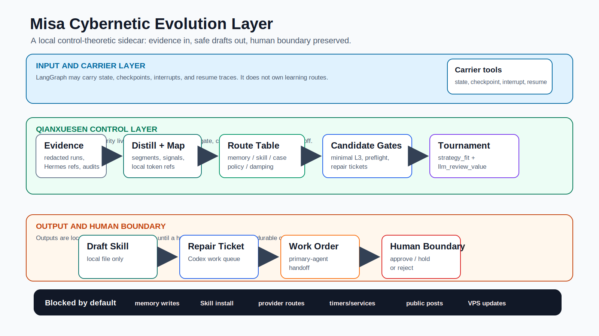

# Misa Cybernetic Evolution Layer

A control-theoretic learning sidecar for Hermes-style AI agents.

Current package version: `0.25.0`. The current line keeps source-lineage and
retrieval trace metadata for vector-memory dry runs, adds a default local
persistent vector store, adds read-only session-distiller cybernetic review,
adds the first skill-evolution adapter surface, adds a Hermes runtime adapter
contract, adds seeded work-order variants, adds work-order quality evaluation,
adds issue/PR-shaped dev/test work-order samples,
and keeps the control boundary stable: no live Zilliz writes, no provider
embeddings, and no runtime changes.



## One-Line Verdict

This is the local control layer that helps Misa learn from real work without
silently changing production behavior.

## Current Position

This repository is a local dry-run and shadow-ready learning plane. It turns
completed agent work into evidence-backed drafts for memory, skills, cases,
policy, and damping.

It is useful as:

- Misa/Hermes structure reference;
- local precheck layer;
- read-only replay and distillation fixture suite;
- local candidate optimization and repair-ticket generator;
- primary-agent work-order handoff format.

It is not a production autonomous brain.

## Quickstart

```bash
git clone https://github.com/0xPanty/misa-cybernetic-evolution.git
cd misa-cybernetic-evolution
npm ci
npm run doctor
npm run bootstrap:local
```

The full clone-to-local-store path is documented in
[QUICKSTART.md](./QUICKSTART.md).

## System Shape

The framework has three layers:

| Layer | Owner | Job |
| --- | --- | --- |
| Input and carrier | LangGraph-compatible carrier, local files, existing Hermes/Zilliz refs | carry state, source refs, checkpoints, interrupts, and resume traces |
| Qianxuesen control | this repo's deterministic sidecar | distill, split, route, gate, compare, and keep live effects off |
| Output and human boundary | primary agent plus human owner | let the agent self-review and fix low-risk local items, while durable changes still need approval |

The important rule is simple: carrier tools may move evidence around, but the
Qianxuesen route table owns learning decisions.

## Current Boundary

The safety boundary is deliberate:

| Surface | Current state |
| --- | --- |
| Persistent memory writes | not enabled |
| Skill installation or publication | not enabled |
| Provider route changes | not enabled |
| Discord/Farcaster live behavior changes | not enabled |
| Background timers or services | not enabled |
| VPS update authority | not enabled |
| LLM route or winner authority | not enabled |
| Local vector-store writes | explicit command only, under ignored `runs/local-vector-store/` |
| Skill evolution changes | replay-required candidates only, no automatic skill mutation |
| Hermes runtime adapter | observe-only hook normalization; no runtime block, memory write, or skill write |
| Stability safe mode | monitor output only; when active, accept `damping` and `ignore` until human release |
| Outer-loop review | recommendation only; cannot change setpoints, route predicates, or metric registry without human review |

In plain terms: this sidecar can read redacted local evidence, compress it,
route it, draft safe local artifacts, compare candidate variants, and explain
what should be repaired next. It cannot make production decisions by itself.

## Core Loop

```text
redacted local source
or existing Hermes/Zilliz distillation artifact
-> distill and segment
-> map refs into local Qianxuesen input
-> split compound windows into atomic lessons
-> route to memory / skill / case / policy / damping
-> compare broad Auto-L3 against minimal positive L3
-> export only safe local skill drafts
-> generate repair tickets for unsafe over-promotion patterns
-> route work orders to the primary agent
-> compare baseline work orders against variant winners on Qianxuesen quality metrics
-> let the agent self-review and resolve low-risk local work when policy allows
-> supervise behavior events against skill evolution contracts
-> open replay-required improvement candidates inside allowed evolution space
-> classify logs, decisions, candidate experience, policy, and work orders for vector storage
-> optionally upsert the public distillation template into the default local vector store
-> attach original-source refs, replay keys, and retrieval hints for future hit explanation
-> produce a shadow perception digest that prioritizes sources without route authority
-> score which existing signals are worth LLM or GEPA-style variant generation
-> normalize Hermes runtime hook traces into research digests and replay candidates
-> keep raw logs, redacted sources, perception digests, handoffs, and archives separated
-> run reportable candidates through a local evolution tournament
-> choose the best safe draft variant
-> mark whether optional LLM review has concrete critique value
-> validate with schemas, precheck, and tests
```

The route split is the core control rule:

| Route | Meaning | Example |
| --- | --- | --- |
| `memory` | stable user preference or project fact | "Huan wants Chinese-first, plainspoken answers." |
| `skill` | repeatable procedure | "Run these checks after changing the cybernetic gate." |
| `case` | repeated failure or recovery pattern | "Provider timeouts should be diagnosed before redesign." |
| `policy` | future behavior boundary or approval rule | "Do not leak private memory into public Farcaster replies." |
| `damping` | hold weak evidence to avoid overreaction | "Do not rebuild a provider path from one timeout." |

Two rules matter most:

- one bad run normally goes to `damping`, not permanent memory or a new Skill;
- public-channel memory risk goes to `policy`, even when a workflow signal is
  also present.

## Current Capabilities

| Capability | Command | Boundary |
| --- | --- | --- |
| Public repo doctor | `npm run doctor` | clone-time readiness check; read-only |
| Local bootstrap | `npm run bootstrap:local` | initializes ignored local vector store and local report only |
| Learning-loop simulation | `npm run simulate:misa` | local fixtures only |
| Local session distillation | `npm run distill:misa` | no Zilliz, no embedding provider, no external API |
| Shadow perception digest | `npm run perception:digest -- --json` | sensor/prioritizer only; optional `--ledger-file` emits action recommendations and no-write ledger update proposals |
| Perception log layout | `npm run perception:layout` | local directory contract only; `--init` creates separated dry-run folders under the chosen root |
| Curiosity signal gate | `npm run curiosity:signals -- --json` | deterministic value gate for LLM/GEPA variant generation; no provider call |
| Hermes/Zilliz mapping | `npm run hermes:map-distillation -- --json` | translates refs, does not copy or write Zilliz |
| Hermes runtime adapter | `npm run hermes:adapt-runtime -- --json` | observe-only Hermes hook adapter; turns skill/memory/research traces into digests and replay candidates |
| Hermes work orders | `npm run hermes:work-order -- --json --dry-run` | turns Hermes self-evolution signals into Qianxuesen work orders, variants, selected winners, and quality comparisons |
| Hermes plugin install | `npm run hermes:plugin:install` | copies the observe-only plugin sample into a local Hermes plugin folder |
| Hermes plugin doctor | `npm run hermes:plugin:doctor` | checks plugin files and replays local NDJSON events when present |
| Context-density review | `npm run density:misa` | rejects high-authority runtime imports |
| Adaptive candidate gate | `npm run adaptive:misa` | local candidate widening only |
| Signal intake contract | `npm run intake:misa` | cadence contract, no scheduler startup |
| Daily signal rollup | `npm run rollup:misa` | local queue and report only |
| Candidate preflight | `npm run evolution:evaluate:misa` | report queue only |
| Evolution tournament | `npm run evolution:tournament:misa` | local draft winner only |
| Post-deploy measurement | `npm run post-deploy:measure` | local setpoint backtest; recommends rollback/damping but cannot execute it |
| Stability monitor | `npm run stability:monitor` | local divergence gate; safe mode freezes promotion routes in output only |
| Outer-loop review | `npm run outer-loop:review` | weekly slow-loop review; suggestions only, no route or metric mutation |
| Loser pressure quant | `npm run loser:pressure -- --target-samples=1000` | local loser-memory pressure report; model can generate samples only |
| Loser pressure matrix | `npm run loser:matrix -- --target-samples=1000` | multi-scenario parameter sweep for accumulated loser evidence |
| Memory-layer comparison | `npm run memory-layer:misa` | compares broad vs minimal L3 |
| Local skill export | `npm run export-skills:misa` | writes draft files, does not install Skills |
| Repair tickets | `npm run repair-ticket:misa -- --dry-run` | local work queue only |
| Session distiller review | `npm run session-distiller:review -- --json --summary-file <file>` | review distiller/Zilliz artifacts and open work-order candidates only |
| Work-order routing | `npm run work-order:route -- --dry-run` | default risk-graded self-review, still no durable/public execution |
| Work-order variants | `npm run work-order:variants -- --json --dry-run` | seeded local candidate work orders; LLM critique is value-gated and zero-call by default |
| Work-order quality eval | `npm run work-order:evaluate -- --json --dry-run` | baseline-vs-winner quality score for final Qianxuesen work-order packets |
| Skill evolution supervisor | `npm run skill:evolution` | behavior adapter plus skill contract review; can propose replay-required candidates, cannot mutate skills |
| Vector memory classification | `npm run vector-memory:classify -- --json` | Zilliz/local-vector storage plan only, no writes |
| Local vector store | `npm run vector-store:local -- --mode upsert` | default persistent local JSONL/token-vector backend under ignored `runs/local-vector-store/`; adapters must accept the public distillation template |
| Vector retrieval ranker | `npm run vector-memory:rank -- --eval-fixtures` | kind filter and same-source rerank dry-run, no embeddings or writes |
| Zilliz adapter dry-run | `npm run zilliz:adapt -- --json` | collection and upsert payload only, no embeddings or writes |
| LangGraph bridge contract | `npm run langgraph:bridge -- --json` | carrier contract only |
| OmniAgent footprint bridge | `npm run omniagent:footprint` | footprint as evidence only |
| Current-line smoke | `npm run smoke:current-line` | one dry-run guard for session review, work orders, variants, quality eval, tournament, stability, outer-loop, skill evolution, curiosity signals, Hermes runtime adapter/work-order/plugin, local vector store, ranker, and Zilliz adapter |
| Current-line calibration | `npm run calibrate:current-line` | redacted sample calibration for signal layers, route, work-order, retrieval, tournament, and judge value |
| Qianxuesen full-loop health | `npm run health:qianxuesen` | small latest/history manifest for the full local shadow loop, with artifact pointers |

## Experiments

External trajectory analysis and L1-L4 selection audit commands now live under
`experiments/`. They are experiment lines, not v0.25 current-line requirements.
Default CI and `npm test` do not run them; run `npm run test:experiments` only
when you intentionally want to replay those lines.

The old `external:*`, `selection-audit:*`, `l1-*`, and `l3-*` command families
have been renamed under these experiment script families:

- `experiments:external:*`
- `experiments:selection-audit:*`

See `experiments/external-trajectory/README.md` and
`experiments/selection-audit/README.md`.

## Current-Line Command Map

README keeps only the short human entrypoints. The canonical command surface and
CI order live in [docs/verification-matrix.md](./docs/verification-matrix.md).

The two current-line commands most reviewers should reach for are:

- `npm run smoke:current-line`
- `npm run calibrate:current-line`

For a quick run-level verdict plus artifact pointers, use:

- `npm run health:qianxuesen`

It writes a small ignored manifest under `runs/qianxuesen-full-loop/` with
`latest.json`, `latest.md`, and timestamped history. It does not copy full logs
or add runtime authority.

## Perception Log Layout

`perception:layout` records the folder split for future full-log perception. By
default it only prints the contract. Passing `--init` creates the local dry-run
tree under `runs/perception-runtime`, which is ignored by Git.

```text
runs/perception-runtime/
  runtime/raw/
  runtime/redacted-sources/
  perception/digests/
  perception/signal-ledger/
  perception/attention/
  handoff/
  archive/
```

Plain rule: raw logs are not learning material. Redacted and normalized sources
feed perception; perception outputs hints, duplicate-cluster reports, and
no-write ledger proposals; only selected attention items move toward handoff.
Noise, already-handled repeats, and rejected candidates stay in one archive
bucket instead of becoming their own workflow.

Perception output names such as `action_recommendations`, `attention_queue`, and
`ledger_update_proposals` are review surfaces, not execution commands. They must
stay `hint_only` or `proposal_only`, and ledger proposals must stay `no_write`.

## Curiosity Signal Gate

`curiosity:signals` decides which existing signals are worth deeper LLM or
GEPA-style variant generation. It does not create a second candidate pool.

Plain rule:

```text
all signals stay in the existing candidate flow
ordinary signals stay deterministic
high-value signals may ask an LLM to draft variants later
Qianxuesen still owns route, replay, tournament, and promotion
```

The gate looks at perception priority, route pressure, ledger recurrence,
public-boundary risk, replay failures, repeated failures, duplicate workflow
evidence, external framework/protocol drift, competitor pressure, user
corrections, knowledge gaps, repeated terminology, and review-value hints. Its
output is advisory only:
`llm_variant_generation_recommended`, `deterministic_review_optional`,
`ordinary_candidate_flow`, or suppression for handled/noisy items.

The important distinction is simple: a one-off buzzword stays cheap and
deterministic; an external change plus a knowledge gap can become a research
digest or LLM-generated variant candidate, but it still has to pass replay and
tournament before anything durable changes.

## Local Vector Store

`vector-store:local` is the default public-repo vector backend. It gives users
who do not run Zilliz a persistent local store with `upsert`, `query`, `stats`,
and `rollback` surfaces.

Users who already run Zilliz, Qdrant, LanceDB, Chroma, pgvector, or another
store can replace the backend, but the adapter must accept the same
`misa.local_session_distillation.v1` template and return the same source-lineage
fields.

## Skill Evolution Adapter

`skill:evolution` is the first behavior-layer plug-in surface. A behavior layer
reports a structured event, a skill declares its allowed evolution space, and
Qianxuesen checks both sides.

The default Farcaster example proves the intended shape:

- public reply drafts may create `reply_scoring` improvement candidates;
- candidates must pass replay before promotion;
- private-memory, high-risk publish, and direct durable writes stay blocked;
- the supervisor does not call LLMs, mutate skills, write memory, or change
  route ownership.

This is the "runway plus guardrail" layer: it gives skills a place to evolve
while keeping hard boundaries machine-checkable.

## Hermes Runtime Adapter

`hermes:adapt-runtime` is the first concrete framework plug shape. It does not
try to make Qianxuesen a Hermes-only feature. It maps Hermes hook evidence into
the universal adapter contract:

- `skill_manage` changes become replay-required skill candidates;
- `memory` writes become memory or policy pressure, not durable memory;
- `session_search` and external-research traces become research digests;
- curator/background review output becomes candidate pressure;
- every candidate still has to enter replay and tournament before promotion.

Plain rule: Hermes can be the carrier runtime, but Qianxuesen still owns the
learning decision. The default adapter is observe-only and call-free.

The installable sample lives in `examples/hermes-runtime-plugin`:

```bash
npm run hermes:plugin:install
npm run hermes:plugin:doctor
npm run hermes:adapt-runtime -- --event-log ~/.hermes/qianxuesen-runtime-events.ndjson --json
```

The plugin only writes a local NDJSON event log. It does not block Hermes tools,
write Hermes memory, change skills, call models, or call external APIs.

Hermes signals do not stop at observe-only. The public work-order chain turns
runtime pressure into Qianxuesen work orders:

```bash
npm run hermes:work-order -- --event-log ~/.hermes/qianxuesen-runtime-events.ndjson --json --dry-run
```

That command keeps Hermes' self-evolution advantage by moving signals directly
into work orders, seeded variants, selected winners, and quality comparisons.
It still does not write Hermes memory, mutate skills, publish, call models, or
call external APIs.

## Evolution Tournament

The tournament is an inner optimizer, not the learning controller.

It borrows the useful shape from self-evolution systems:

- generate multiple draft variants;
- score train/validation/holdout checks;
- keep route and source trace fixed;
- choose a Pareto-style local winner;
- retain safe losers and unsafe variants as local experience evidence.

It rejects the dangerous shape:

- no automatic memory writes;
- no Skill installation;
- no LLM-owned route decisions;
- no prompt or code self-rewrite;
- no provider or VPS changes;
- no continuous production self-improvement loop.

The `experience_ledger` in tournament output is only a local shadow ledger. It
keeps source-backed preflight notes, non-winning safe variants, and rejected
unsafe variants for later comparison; it does not write memory or publish
anything.

## Work-Order Variants

`work-order:variants` adds the EvoPrompt-inspired part that fits this repo: a
small seeded search over possible work-order shapes. It does not create a new
controller.

```text
work-order:route
-> seeded work-order variants
-> deterministic scoring
-> optional LLM critique recommendation only when value signals justify it
-> one draft winner, losers retained as experience
```

Default behavior is zero-call and local-only:

- seeded randomness is reproducible;
- the command does not execute work orders;
- LLM critique is only recommended, never called by default;
- route, winner authority, memory writes, skill installs, public output, and
  production effects stay blocked.

v0.18 adds two decision-quality checks:

- `strategy_fit`, so the winner must fit the route/source pressure;
- `llm_review_value`, so model review is only suggested when there is a concrete
  critique target.

Default judge mode is `advise`, which keeps `llm_api_calls=0`. `--judge-mode auto`
may call a reviewer only when `llm_review_value.level=high`. The reviewer can
add critique notes, but it cannot change the route or winner.

## Work-Order Quality Evaluation

`work-order:evaluate` keeps the EvoPrompt-inspired search honest. It compares
the original work-order packet with the variant winner across source trace,
replayability, boundary safety, handoff clarity, control-loop fit, and
Qianxuesen fit.

The point is not that the command passes. The point is whether the final work
order is more useful for the next agent without adding live effects or token
spend.

```bash
npm run work-order:evaluate -- --json --dry-run
```

## Validation

The canonical validation chain lives in
[docs/verification-matrix.md](./docs/verification-matrix.md). Keep that file
and `.github/workflows/current-line-shadow.yml` as the source of truth for the
exact CI order.

Current local review usually runs the same shadow gate:

```bash
npm run validate:schemas
npm run smoke:current-line
npm run calibrate:current-line
npm run precheck
npm test
```

The calibration signal-layer details live in
[docs/current-line-calibration-v0.21.md](./docs/current-line-calibration-v0.21.md).
That map is descriptive only; it does not add a controller, writer, provider
call, or route authority.

For machine-to-machine JSON handoff, do not redirect plain npm-script JSON
stdout into the next command. Use silent npm mode, direct script execution, or
`--out-file <path>` so the file contains only JSON.

## v0.25 Direction

Do not add another governance layer by default. The useful v0.25 work is:

1. keep the current route labels and tournament variants stable;
2. keep vector-memory records traceable back to opaque original-source refs;
3. rank retrieval hits by requested kind before same-source context;
4. keep `should_change_winner=false` and LLM route authority blocked;
5. let session-distiller review open repair work-order candidates without
   mutating production state;
6. record shadow tournament outcomes with human accept/reject labels;
7. calibrate `strategy_fit`, `judge_escalation`, and `llm_review_value` against
   redacted samples with `npm run calibrate:current-line`;
8. keep the signal-layer map visible in calibration output instead of spreading
   it across chat-only explanations;
9. reduce maintenance noise in precheck, README, and tests;
10. close the Hermes adapter loop with an installable observe-only plugin and
    local NDJSON replay;
11. make work-order output smarter through seeded variants and value-gated LLM
    critique recommendations;
12. measure final work-order quality against Qianxuesen control-loop metrics
    instead of treating command success as enough;
13. add local issue/PR-shaped dev/test samples so quality changes must pass a
    held-out work-order check, not only the original regression set.

The scarce thing now is not more abstraction. It is calibration evidence and
replayable source lineage.

The new public default for work orders follows that rule too: let the agent
practice on bounded local work, keep self-review logs as candidate experience,
and only widen authority when the user explicitly asks for it.

## Documentation Map

Current-state docs:

Versioned document names such as v0.18 and v0.20 are historical anchors for
features that still feed the v0.25 line. They are not separate current release
tracks; use the command map and validation chain above for the current surface.

- [Architecture](./ARCHITECTURE.md)
- [Control contract](./CONTROL_CONTRACT.md)
- [Verification matrix](./docs/verification-matrix.md) - canonical command surface and current local shadow gate
- [Source synthesis](./docs/source-synthesis.md)
- [Memory-layer and Skill export](./docs/memory-layer-skill-export-v0.13.md)
- [Work-order routing](./docs/work-order-routing-v0.14.md)
- [Work-order variants](./docs/work-order-variants-v0.23.md)
- [Work-order quality evaluation](./docs/work-order-quality-eval-v0.24.md)
- [Work-order external samples](./docs/work-order-external-samples-v0.25.md)
- [Skill evolution adapter](./docs/skill-evolution-adapter-v0.22.md)
- [Skill control intake template](./docs/skill-control-intake-template.md)
- [Vector memory storage](./docs/vector-memory-storage-v0.19.md)
- [Local vector store](./docs/local-vector-store-v0.21.md)
- [Zilliz vector adapter](./docs/zilliz-vector-adapter-v0.19.md)
- [Retrieval lineage](./docs/retrieval-lineage-v0.19.md)
- [Vector retrieval ranker](./docs/vector-retrieval-ranker-v0.20.md)
- [Evolution tournament v0.18](./docs/evolution-tournament-gate-v0.18.md)
- [Current-line calibration v0.21](./docs/current-line-calibration-v0.21.md)

Bridge docs:

- [Hermes/Zilliz mapping](./docs/hermes-distillation-mapping-v0.15.md)
- [LangGraph/Qianxuesen bridge](./docs/langgraph-qianxuesen-bridge-v0.15.md)
- [OmniAgent footprint bridge](./docs/omniagent-footprint-bridge-v0.16.md)

History and calibration:

- [Version changelog and calibration notes](./docs/changelog.md)

## Remotion Diagram Source

The diagram above has a Remotion storyboard source at
[docs/remotion/langgraph-qianxuesen-flow.tsx](./docs/remotion/langgraph-qianxuesen-flow.tsx).
It is kept as a future animation source for the same logic: evidence in, local
control decisions, safe drafts out, human boundary preserved.

## License

Apache-2.0
